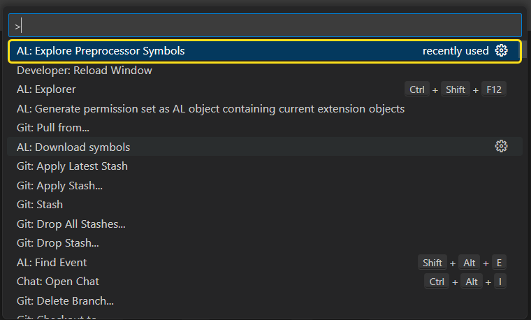
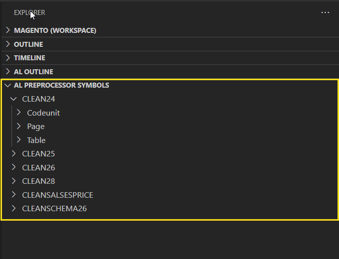

# AL Preprocessor Explorer

> Visual Studio Code extension for discovering and navigating AL preprocessor symbols with ease.

---

## 🔍 Features

- 📄 Scans your entire workspace for AL preprocessor directives like `#define`, `#if`, `#elif`, `#if not`.
- 🧠 Intelligently extracts symbols even from complex conditions (`and`, `or`, `not`).
- 📁 Groups occurrences by object type (Tables, Pages, Codeunits, etc.).
- 🌳 Displays all symbols and their usages in a custom Explorer Tree View.
- ✨ Click-to-navigate directly to the exact location in your `.al` files.
- 🧼 Ignores commented lines to ensure accurate symbol detection.
- 🕵️‍♂️ Clean, modern UI with collapsible tree nodes.
- 🔤 Automatically sorts symbols alphabetically for quick discovery.

---

## 🚀 Getting Started

1. Install the extension from the [Visual Studio Code Marketplace](https://marketplace.visualstudio.com/).
2. Open a Business Central AL project in VS Code.
3. Open the Command Palette (`Ctrl+Shift+P` / `Cmd+Shift+P`).
4. Run: `AL: Explore Preprocessor Symbol`.
5. Check the **"AL Preprocessor Explorer"** view on the left side panel.

---
## 📸 Screenshots
### 🧭 Find the Command



### 🌲 Explorer Tree View

Shows all detected preprocessor symbols in a collapsible tree, grouped and sorted:


---

## 📂 Example
```al
#define CLEAN26

#if not CLEAN26 and CLEAN27
    // conditional logic
#endif
